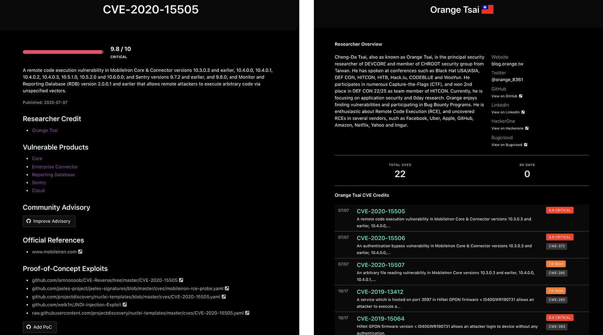

# cvebase.com Wiki Data Repository

This is the official data repository of CVE & Researcher data for cvebase. Updates are synced with the CVE and Researcher profile pages at [cvebase.com](https://www.cvebase.com/).

### What is cvebase?
cvebase is a community-driven data platform for security vulnerabilities, developed for use by security researchers, penetration testers, and bug bounty hunters.

* Researcher profiles feature their published CVEs to date.
* Community commentary enhances and clarifies official CVE vendor advisories.
* References link to valid Proof-of-Concept Exploits and detailed technical writeups.

## Usage
CVE files are located in the `/cve/` directory, organized by year and sequence identifier following the convention set by [`CVEProject/cvelist`](https://github.com/CVEProject/cvelist):

> Information about each CVE id is stored as a unique file in the repo in a subdirectory based on the year as well as the numeric portion of the id, truncated by 1,000. Thus,  2017/3xxx is for CVE-2017-3000 - CVE-2017-3999, and 2017/1002xxx is for CVE-2017-1002000 - CVE-2017-1002999.

Researcher profiles are in the `/researcher/` directory, named by researcher slug.

Inspired by static site generator [`gohugoio/hugo`](https://github.com/gohugoio/hugo), the Markdown file have YAML "front matter" to define metadata for both CVEs and Researchers.

See example files here:
* [/cve/2020/15xxx/CVE-2020-15505.md](https://raw.githubusercontent.com/cvebase/cvebase.com/main/cve/2020/15xxx/CVE-2020-15505.md)
* [/researcher/orange.md](https://raw.githubusercontent.com/cvebase/cvebase.com/main/researcher/orange.md)

## Status
The project is currently under active development. Please follow us on twitter [@cvebase](https://twitter.com/cvebase) and check back soon.

## Contributing
* Send pull requests
* [Create an issue](https://github.com/cvebase/cvebase.com/issues) in this repository

## License
Repository content licensed [CC BY-NC-SA 4.0](https://creativecommons.org/licenses/by-nc-sa/4.0/).
